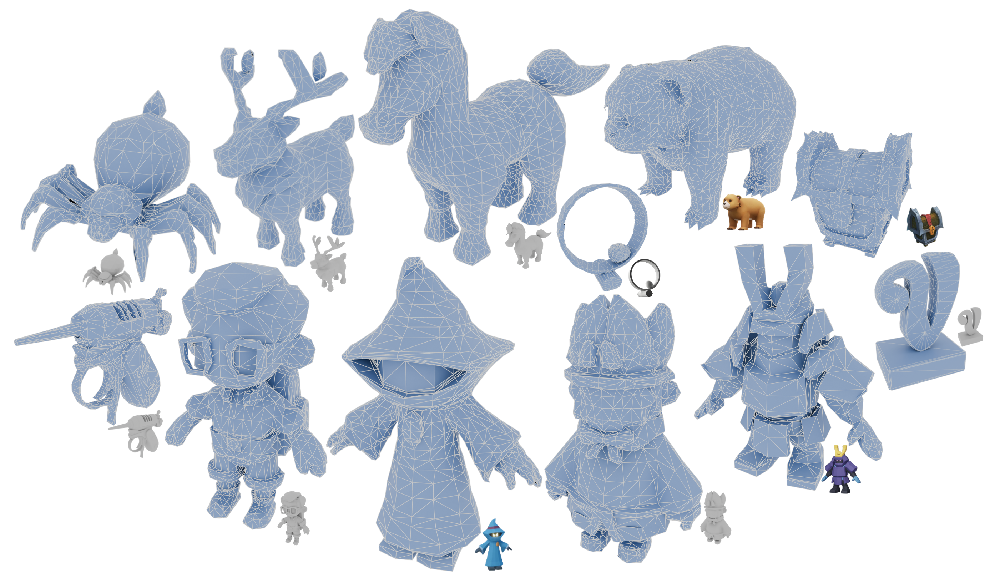

# Scaling Mesh Generation via Compressive Tokenization

### [Project Page](https://whaohan.github.io/bpt)  | [Paper](https://arxiv.org/abs/2411.07025) | [Weight](https://huggingface.co/whaohan/bpt/tree/main)


## 📑 Open-source Plan

- [x] Inference conditioned on point cloud
- [x] Checkpoints
- [x] Evaluation metrics
- [ ] Inference conditioned on images
- [ ] Training


## **Abstract**
<p align="center">
  
</p>

We propose a compressive yet effective mesh representation, Blocked and Patchified Tokenization (BPT), facilitating the generation of meshes exceeding 8k faces. BPT compresses mesh sequences by employing block-wise indexing and patch aggregation, reducing their length by approximately 75% compared to the original sequences. This compression milestone unlocks the potential to utilize mesh data with significantly more faces, thereby enhancing detail richness and improving generation robustness. Empowered with the BPT, we have built a foundation mesh generative model training on scaled mesh data to support flexible control for point clouds and images. Our model demonstrates the capability to generate meshes with intricate details and accurate topology, achieving SoTA performance on mesh generation and reaching the level for direct product usage.

## 🎉 **Blocked and Patchified Tokenization (BPT)**

<p align="center">
  
</p>


## Get Started

#### Begin by cloning the repository:

```shell
git clone https://github.com/whaohan/bpt.git
cd bpt
```

#### Installation Guide for Linux


Install the packages in `requirements.txt`. The code is tested under CUDA version 12.1 and python 3.9.

```bash
conda create -n bpt python=3.9
conda activate bpt
pip install torch==2.1.2 torchvision==0.16.2 --index-url https://download.pytorch.org/whl/cu121
pip install -r requirements.txt
```


#### Download Pretrained Models

The models are available at [huggingface](https://huggingface.co/whaohan/bpt/tree/main). 
Currently, we resealse a lite version of model with the point-encoder finetuned from [Michelangelo](https://github.com/NeuralCarver/Michelangelo).

To download the model, first install the huggingface-cli. (Detailed instructions are available [here](https://huggingface.co/docs/huggingface_hub/guides/cli).)

```shell
python3 -m pip install "huggingface_hub[cli]"
```

Then download the model using the following commands:

```shell
mkdir weights
huggingface-cli download whaohan/bpt --local-dir ./weights
```

#### Inference conditioned on point clouds
For text to 3d generation, we supports bilingual Chinese and English, you can use the following command to inference.
```python
python main.py \
    --config 'config/BPT-open-8k-8-16.yaml' \
    --model_path /path/to/model/ckpt \
    --output_path output/ \
    --batch_size 1 \
    --temperature 0.5 \
    --input_type mesh \
    --input_dir /path/to/your/dense/meshes
```
It requires ~12GB VRAM to run with fp16 precision. It takes averagely 2mins to generate a single mesh.


#### Evaluation

```bash
python metrics.py \
    --input_dir /path/to/dense/meshes \
    --output_dir /path/to/output/meshes
```

### Acknowledgement

- [MeshGPT](https://github.com/lucidrains/meshgpt-pytorch)
- [PivotMesh](https://github.com/whaohan/pivotmesh)
- [Michelangelo](https://github.com/NeuralCarver/Michelangelo)
- [MeshAnything](https://github.com/buaacyw/MeshAnythingV2/)
- [MeshXL](https://github.com/OpenMeshLab/MeshXL/)


## Citation

If you found this repository helpful, please cite our report:
```bibtex
@article{weng2024scaling,
  title={Scaling Mesh Generation via Compressive Tokenization}, 
  author={Haohan Weng and Zibo Zhao and Biwen Lei and Xianghui Yang and Jian Liu and Zeqiang Lai and Zhuo Chen and Yuhong Liu and Jie Jiang and Chunchao Guo and Tong Zhang and Shenghua Gao and C. L. Philip Chen},
  journal={arXiv preprint arXiv:2411.07025},
  year={2024}
}
```
